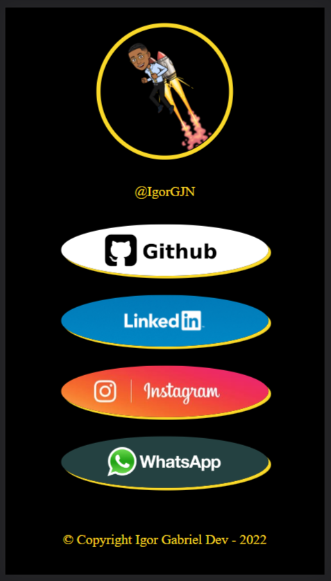

# linktree
 Meu Linktree

## 💻 Sobre o Projeto
Projeto pessoal do meu linktree, utilizando o display flex.

## 🔗 Como acessar
Link -> [https://igorgjn.github.io/linktree/](https://igorgjn.github.io/linktree/)

### 📅 Ultima atualização 
16 de Julho de 2022

## 🎨 Layout
<code></code>
<!--
## 🆕 Novidades
Layout responsivo para mobile. 
Organização dos arquivos. -->

<!-- ### Proximas atualizações 
## 🔢 Versões
-->
## 🛠 Tecnologias

As seguintes ferramentas foram usadas na construção do projeto:

<code></code>
<code></code>

## 📝 Licença

Este projeto esta sobe a licença MIT.

Feito por Igor Gabriel - [Entre em contato!](https://www.linkedin.com/in/IgorGJN/)

&copy; Copyright I Dev - 2022